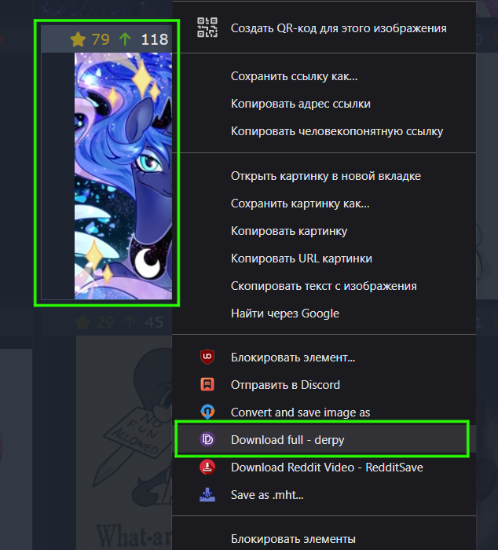

# Derpibooru Full Downloader

**Derpibooru Full Downloader** — это расширение для Google Chrome, добавляющее контекстное меню для загрузки полной версии изображений с сайта [derpibooru.org](https://derpibooru.org).

---

## Установка расширения вручную (режим разработчика)

1. **Скачайте ZIP-архив** этого репозитория:

   * Нажмите на зелёную кнопку **Code** в верхней части страницы.
   * Выберите **Download ZIP**.
   * Распакуйте архив в удобное место на вашем компьютере.

2. **Откройте Google Chrome**.

3. В адресной строке введите:

```
chrome://extensions
```

4. В правом верхнем углу включите **Режим разработчика** (Developer mode).

5. Нажмите кнопку **Загрузить распакованное расширение** (Load unpacked).

6. В появившемся окне выберите папку, куда вы распаковали ZIP-архив (ту, где находится файл `manifest.json`).

7. Готово! Расширение установлено и готово к использованию.

---

## Как использовать

1. Перейдите на сайт [derpibooru.org](https://derpibooru.org).
2. Кликните правой кнопкой мыши на изображении.
3. В контекстном меню выберите пункт **Download full - derpy**.
4. Расширение автоматически загрузит полную версию изображения без открытия диалога "Сохранить как".


## Скриншот



---

## Описание функционала

* **Фоновый скрипт** (background.js) добавляет пункт **Download full - derpy** в контекстное меню при установке расширения.
* Расширение извлекает ID изображения из URL, делает запрос к API Derpibooru и скачивает полную версию изображения.
* Загружает файл без диалога "Сохранить как", автоматически определяя имя файла.
